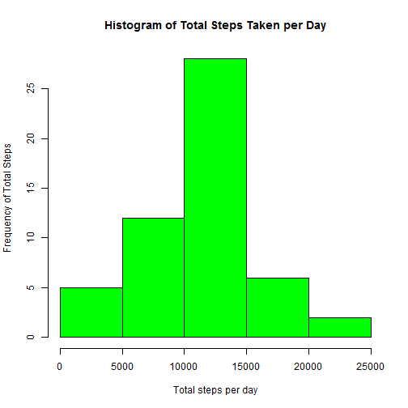
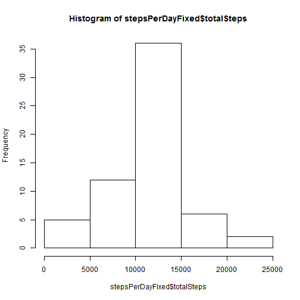

# Reproducible Research: Peer Assessment 1
This document will explore relationships within walking data from an anonymous individual whom had their steps tracked in 5 minute intervals for a period of 61 days.

## Loading and preprocessing the data
In order to assess the data we first need to load the data into R.  The data has already been unzipped into the working directory and is named 'activity.csv'.  The data will be loaded into a variable called 'data'.


```r
data <- read.csv("activity.csv")
```


## What is mean total number of steps taken per day?


```r
stepsPerDay <- aggregate(data$steps,by=list((data$date)),sum)
names(stepsPerDay) <- c("day", "totalSteps", xlab = "Total steps per day", ylab = "Frequency of days for total steps")
```

```
## Error: 'names' attribute [4] must be the same length as the vector [2]
```

```r
hist(stepsPerDay$totalSteps, col = "green")
```

```
## Error: 'x' must be numeric
```

```r
median(stepsPerDay$totalSteps, na.rm=TRUE)
```

```
## Warning: is.na() applied to non-(list or vector) of type 'NULL'
```

```
## NULL
```

```r
mean(stepsPerDay$totalSteps, na.rm=TRUE)
```

```
## Warning: argument is not numeric or logical: returning NA
```

```
## [1] NA
```

## What is the average daily activity pattern?

```r
stepsPerInterval <- aggregate(data$steps,by=list((data$interval)),mean, na.rm=TRUE)
names(stepsPerInterval) <- c("interval", "averageSteps")
plot(stepsPerInterval, type="l", main = "Average Steps Per Interval", xlab="Interval", ylab="Average Steps")
```

 

```r
max(stepsPerInterval$averageSteps)
```

```
## [1] 206.2
```

```r
stepsPerInterval[stepsPerInterval$averageSteps == max(stepsPerInterval$averageSteps),1]
```

```
## [1] 835
```
## Imputing missing values
First, let us determine the number of missing values (NA) in the data set:

```r
sum(is.na(data$steps))
```

```
## [1] 2304
```

This amounts to the following percentage of all data:

```r
sum(is.na(data$steps))/nrow(data)*100
```

```
## [1] 13.11
```

With that proportion of data missing, we cannot just fill the na values in as zeros.  Therefore, it would be best to fill the data with the mean value for that interval.  We should fill by interval, since that is the level that the data is missing on.  We do not want to skew the data since we are not sure what the data actually is.  Let us create this 'fixed' data set.


```r
dataFixed <- data
dataFixed[is.na(dataFixed$steps),]$steps <- stepsPerInterval[match(dataFixed[is.na(dataFixed$steps),]$interval, stepsPerInterval$interval), ]$averageSteps
```

We now how to make a histogram of our new data:


```r
stepsPerDayFixed <- aggregate(dataFixed$steps,by=list((dataFixed$date)),sum)
names(stepsPerDayFixed) <- c("day", "totalSteps")
hist(stepsPerDayFixed$totalSteps)
```

 

```r
median(stepsPerDayFixed$totalSteps)
```

```
## [1] 10766
```

```r
mean(stepsPerDayFixed$totalSteps)
```

```
## [1] 10766
```
## Are there differences in activity patterns between weekdays and weekends?

```r
dataFixed$dayOfWeek <- weekdays(as.Date(dataFixed$date))
dataFixed$weekend <- dataFixed$dayOfWeek == "Sunday" | dataFixed$dayOfWeek == "Saturday"
dataFixed[dataFixed$weekend == TRUE, 'weekend'] <- "weekend"
dataFixed[dataFixed$weekend == FALSE, 'weekend'] <- "weekday"

stepsPerIntervalFixed <- aggregate(dataFixed$steps,by=list((dataFixed$interval), (dataFixed$weekend)),mean, na.rm=TRUE)
names(stepsPerIntervalFixed) <- c("interval", "weekend", "averageSteps")

xyplot(stepsPerIntervalFixed$averageSteps ~ stepsPerIntervalFixed$interval | stepsPerIntervalFixed$weekend, data, type="l", layout = c(1,2), xlab = "Interval", ylab = "Number of steps")
```

```
## Error: could not find function "xyplot"
```

